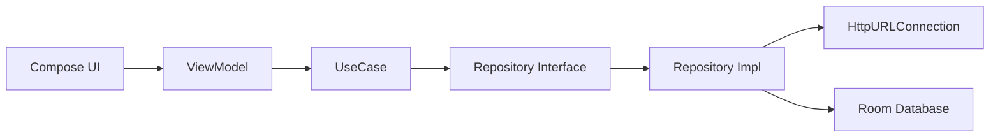

# Compose MVI

> Jetpack Compose, MVI, Clean Architecture를 바탕으로  
> 이미지와 동영상 검색 결과를 한 화면에서 다루는 Android 샘플 프로젝트입니다.

## Overview

이 프로젝트는 `검색`, `상세 보기`, `저장 문서 관리`라는 비교적 단순한 사용자 흐름 안에서  
UI 상태 관리, 레이어 분리, 데이터 매핑, 로컬 저장소 연동을 어떻게 구성할지에 초점을 둡니다.

현재 구조는 다음 방향을 지향합니다.

- `app`: Compose UI, Navigation, ViewModel, MVI 상태 관리
- `domain`: 순수 비즈니스 로직, Entity, Repository Interface, UseCase
- `data`: 네트워크/DB 구현, Repository 구현체, Hilt DI

---

## What It Does

| 기능 | 설명 |
| --- | --- |
| 통합 검색 | 이미지 검색과 동영상 검색 결과를 함께 조회합니다. |
| 무한 스크롤 | 스크롤 하단 도달 시 다음 페이지를 불러옵니다. |
| 상세 보기 | 선택한 결과를 WebView로 열어 원문/상세 내용을 확인합니다. |
| 저장 문서 | 사용자가 저장한 문서를 Room DB에 보관하고 다시 조회합니다. |
| 저장 상태 반영 | 이미 저장한 문서는 검색 결과에서 저장 버튼 노출 여부로 구분합니다. |

---

## Preview Flow

```text
검색어 입력
   ->
검색 결과 조회
   ->
이미지 + 동영상 결과 병합
   ->
정렬 후 리스트 표시
   ->
상세 보기 또는 로컬 저장
```

---

## Architecture

### Layer Diagram



### Module Diagram

```text
app
 -> Presentation layer
 -> Compose / Navigation / ViewModel

domain
 -> Entity / UseCase / Repository Interface
 -> Android 의존성 없는 순수 Kotlin 모듈

data
 -> Repository Impl / DataSource / DI
 -> HttpURLConnection / Gson / Room
```

### Search Flow

```text
SearchingScreen
 -> SearchingViewModel
 -> MediaSearchResultUseCase
 -> MediaSearchingRepository
 -> MediaSearchingRepositoryImpl
 -> MediaSearchingRemoteDataSource
 -> HttpUrlConnectionClient
 -> Kakao Search API
```

### Save Flow

```text
SavedDocumentScreen
 -> SavedDocumentViewModel
 -> SavedDocumentResultUseCase
 -> SavedDocumentRepository
 -> SavedDocumentRepositoryImpl
 -> DocumentLocalDataSource
 -> Room DAO
```

---

## Tech Stack

| Category | Stack |
| --- | --- |
| UI | Jetpack Compose, Material 3 |
| State | MVI-style Contract + ViewModel |
| DI | Hilt |
| Local Storage | Room |
| Network | HttpURLConnection + Gson |
| Async | Kotlin Coroutines |
| Image Loading | Coil |
| Detail Viewer | Accompanist WebView |

---

## Project Structure

```text
ComposeMVI
├── app
│   ├── screen
│   ├── viewmodels
│   ├── contract
│   └── ui
├── domain
│   ├── entity
│   ├── repository
│   └── usecase
└── data
    ├── datasource
    │   ├── local
    │   └── remote
    ├── mapping
    ├── repository
    └── usecase/di
```

---

## Key Implementation Points

### 1. Search Result Merge

이미지 결과와 동영상 결과를 각각 조회한 뒤 `Document` 모델로 매핑하고,  
하나의 리스트로 합쳐 `datetime` 기준 내림차순으로 정렬해 표시합니다.

### 2. Pagination per Content Type

이미지와 동영상은 각각 별도의 페이지 상태를 관리합니다.

- 이미지: `imagePageCount`
- 동영상: `videoPageCount`
- 새 검색어 입력 시 각 페이지는 다시 `1`부터 시작합니다.

### 3. Saved State Decoration

검색 결과를 그리기 전에 저장된 문서 목록을 조회하고,  
이미 저장된 항목은 `isSaveButtonVisible` 상태를 통해 UI에 반영합니다.

### 4. Pure Domain

`domain` 모듈은 Android Framework에 의존하지 않도록 분리했습니다.  
UseCase 생성은 `data` 모듈의 Hilt Module에서 담당합니다.

---

## Getting Started

### Requirements

- Android Studio
- JDK 11
- Android SDK 35

### Build

```bash
./gradlew build
```

### Run Debug Build

```bash
./gradlew :app:assembleDebug
```

---

## Main Entry Points

| 위치 | 역할 |
| --- | --- |
| `app/src/main/java/com/example/myapplication/MainActivity.kt` | 앱 시작점 |
| `app/src/main/java/com/example/myapplication/screen/main/MainScreen.kt` | 네비게이션과 탭 구조 |
| `app/src/main/java/com/example/myapplication/viewmodels/SearchingViewModel.kt` | 검색 상태와 이벤트 처리 |
| `domain/src/main/java/com/example/domain/usecase/MediaSearchResultUseCase.kt` | 검색 결과 병합과 페이지 처리 |
| `data/src/main/java/com/example/data/datasource/remote/network/HttpUrlConnectionClient.kt` | HTTP 요청 처리 |
| `data/src/main/java/com/example/data/datasource/local/database/SearchingResultDataBase.kt` | Room DB 진입점 |

---

## Notes

- 이 프로젝트는 학습과 구조 이해를 목적으로 한 샘플 성격이 강합니다.
- 현재 네트워크 계층은 `Retrofit` 대신 `HttpURLConnection`을 사용합니다.
- 운영 환경이라면 API Key 관리, 에러 처리, 로깅, 테스트 커버리지를 추가로 강화하는 편이 적절합니다.
